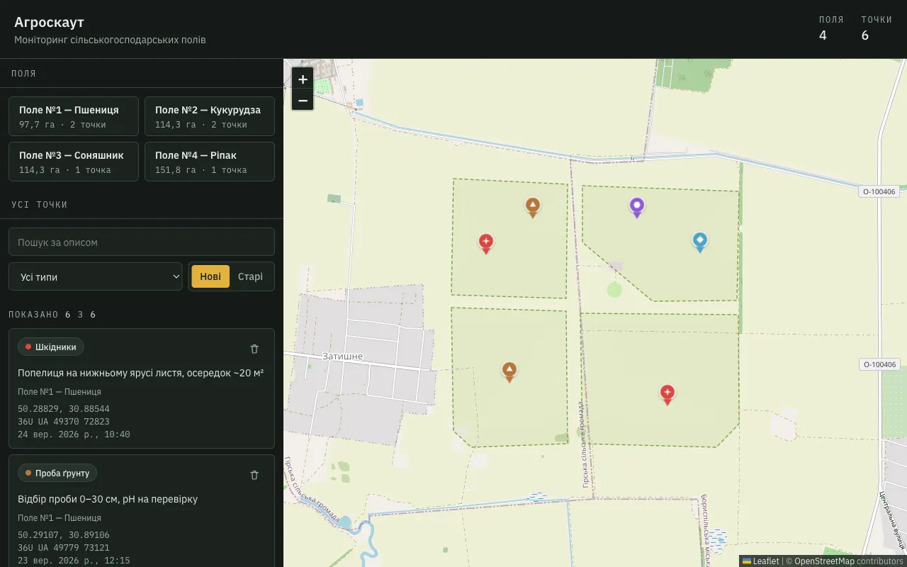
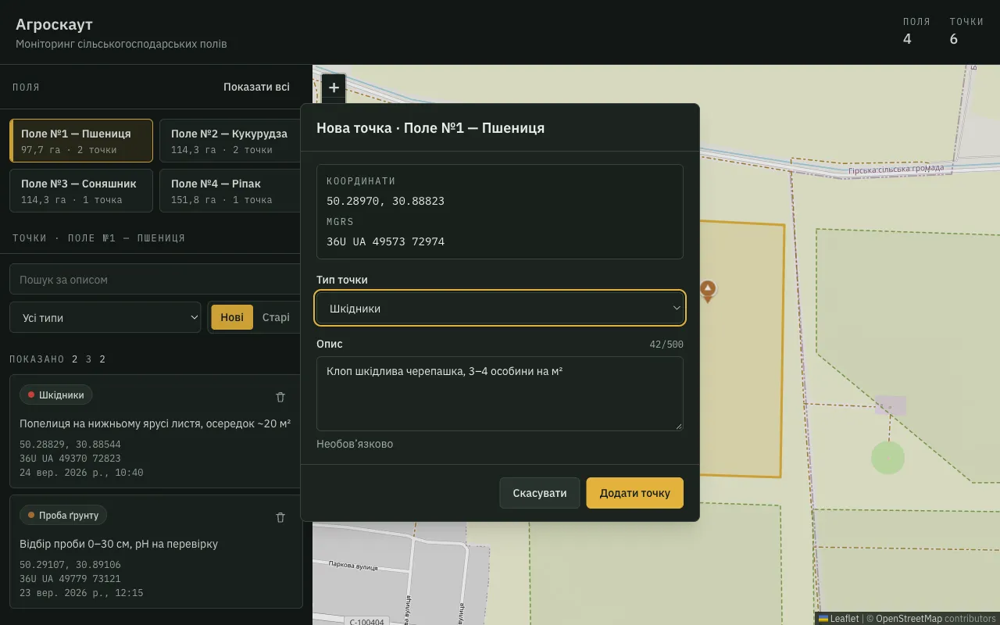
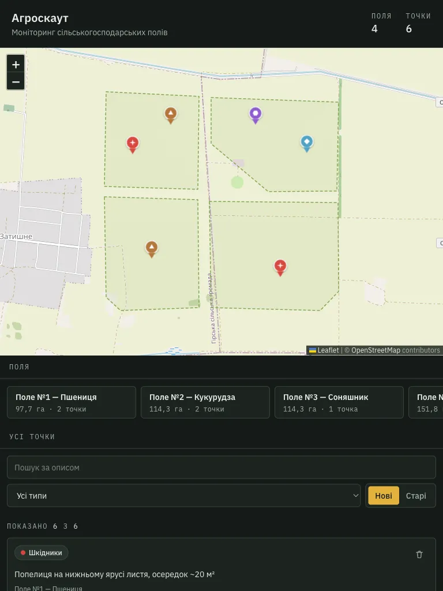

# Агроскаут — моніторинг полів

Карта сільськогосподарських полів з моніторинговими точками. Бекенду немає: поля — mock GeoJSON, точки зберігаються в `localStorage`.

## Запуск

Потрібен Node.js ≥ 22.12.

```bash
npm install
npm run dev
```

Відкрити http://localhost:5173.

| Команда         | Що робить                                    |
| --------------- | -------------------------------------------- |
| `npm run build` | перевірка типів + production-збірка          |
| `npm test`      | юніт-тести                                   |
| `npm run check` | типи + ESLint + Prettier + тести однією дією |

## Що зроблено

- **Карта**: Leaflet, 4 поля з GeoJSON. Поле вибирається в списку або кліком на карті, активне підсвічено, показано назву й площу.
- **Точки**: додаються кліком лише в межах вибраного поля. Кожна має координати WGS84, MGRS (рахується на фронтенді), тип, опис (необов'язково) і дату створення. Іконка залежить від типу. Точку можна видалити з картки або з маркера.
- **Панель**: список усіх точок з фільтром за типом, пошуком за описом і сортуванням за датою.
- **UI**: desktop і tablet. `Esc` повертає карту до загального вигляду.

## Скріншоти

**Загальний вигляд**: усі поля й точки.



**Нова точка**: поле вибране, форма з координатами й MGRS.



**Планшет**: карта зверху, панель під нею.



## Технології

React 19, TypeScript, Vite, Leaflet + react-leaflet, Zustand, Tailwind CSS, `mgrs`, Vitest, ESLint, Prettier.

## Архітектура

```
src/
  data/        mock-поля (GeoJSON)
  lib/         чисті функції: геометрія, MGRS, форматування (з тестами)
  store/       Zustand: поля, точки, відфільтрований список
  components/  ui, layout, map, fields, points
```

- **Zustand** замість Redux чи Context: мало стану, без провайдерів, компонент підписується лише на потрібне поле. Через це карта не перемальовується, коли вводиш пошук.
- **Два стори**: поля з вибраним полем і точки з фільтрами. Відфільтрований список не зберігається, а обчислюється в `useFilteredPoints`.
- **Точка в полігоні** — власний ray casting на ~20 рядків замість turf.js.
- **MGRS** — бібліотека `mgrs`, точність 1 м.
- **localStorage** зберігає лише точки. Дані перевіряються при завантаженні, пошкоджені записи відкидаються.

## Припущення

- Поля статичні, редагувати їх не потрібно.
- Без вибраного поля карта й список показують усі точки, з вибраним — лише точки цього поля.
- Тип точки обов'язковий, тому наперед не обраний. Після першої точки форма пропонує останній обраний тип.
- Поля розміщено на реальній ріллі під Борисполем, площа порахована з геометрії.

## Що б додав, маючи більше часу

- Клік по точці в списку показує її на карті.
- Додавання точки з клавіатури.
- Компонентні й e2e-тести (React Testing Library, Playwright).
- Редагування точок, експорт у GeoJSON/CSV.
- Бекенд замість `localStorage`.
